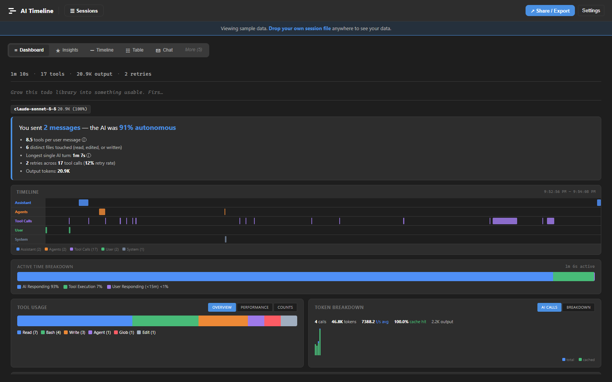

# AI Timeline

[](https://github.com/msdickinson/ai-timeline/actions/workflows/ci.yml)
[](LICENSE)
[](https://msdickinson.github.io/ai-timeline/)
[](#vs-code-extension)

**Your AI coding sessions are already saved on your machine. This shows you what's in them.**

<p align="center">
  <a href="https://msdickinson.github.io/ai-timeline/"></a>
</p>

Every time you use Claude Code, Cursor, Aider, or Copilot — it saves a full record of everything that happened. Every tool call, every token spent, every file it read, every error it hit. It's all sitting in a folder on your machine right now. You've probably never looked at it.

AI Timeline reads those files and shows you what your AI actually did — timelines, token breakdowns, patterns, and things you'd never see in the chat UI.

## 60 seconds. No install.

1. **Open the [web app](https://msdickinson.github.io/ai-timeline/)** (or click "load a sample session" — no files needed)
2. **Drop a session file** from Claude Code, Cursor, Aider, or any of the supported tools
3. **See what happened** — a timeline of every tool call, auto-generated insights, and token breakdowns

Everything runs in your browser. Your data never leaves your machine.

## Why use this

1. **See where time went.** Your session took 15 minutes — was it thinking, running tools, or stuck reading the same file 8 times? The timeline shows you.
2. **Find wasted work.** "40% of tokens spent after the fix was already done." "Grep called 12 times in a row." You'd never know from the chat UI. AI Timeline surfaces these automatically.
3. **Understand your token spend.** Per-event breakdown with cache hit rates. See exactly which calls are expensive and which are cached.
4. **Share sessions with your team.** Export any session as a self-contained HTML file. They open it in a browser — full interactivity, no install. Drop it in Slack, attach it to a PR review.
5. **See what's hidden.** Claude Code spawns sub-agents you never see in the chat UI — they run in the background and their session files are saved locally. Load the folder and see everything they did. Same for any multi-agent workflow.

## Supported Tools

**Tested and stable** — verified with real session data:

| Tool | Format |
|------|--------|
| **Claude Code** | `.jsonl` — richest data: per-event tokens, precise timestamps, tool calls |
| **Cursor / Windsurf / Trae** | `.vscdb` — SQLite parsed via WebAssembly, no server needed |
| **Aider** | `.md` — chat history markdown from your project root |
| **Cline / Roo Code** | `.json` — VSCode extension task history |
| **GitHub Copilot Chat** | `.json` — workspace storage chat exports |

**Additional parsers** — unit tested, may need tweaks for edge cases:

| Tool | Format |
|------|--------|
| OpenHands | `.jsonl` |
| SWE-Agent | `.traj` |
| Codex CLI | `.json` / `.jsonl` |
| Continue.dev | `.json` |
| Amazon Q | `.json` |

All formats auto-detected on load. Just drop the file.

**Don't see your tool?** The [plugin system](CONTRIBUTING.md) makes adding a parser easy — one file, ~50 lines. Or ask your AI to write it.

## What you see

| View | What it shows |
|------|---------------|
| **Dashboard** | Auto-insights ("file read 8 times," "43% tokens wasted"), KPIs, mini Gantt, tool/token breakdown |
| **Timeline** | Zoomable swimlane view — every AI response, tool call, and thinking block. Playback, click-to-inspect. |
| **AI Calls** | Per-model token usage, throughput (tok/s), cache hit rate, call-by-call chart |
| **Tools** | Per-tool stats — call count, avg/p95/max duration, error rate |
| **Table** | Every event in a sortable, searchable spreadsheet |

Plus **Chat**, **Diffs**, **Errors**, and **Findings** in the "More" menu. Additional advanced views available in Settings.

## Where to find your files

| Tool | Where it saves sessions |
|------|------------------------|
| Claude Code | `~/.claude/projects/<slug>/<session>.jsonl` |
| Cursor | `%APPDATA%/Cursor/User/globalStorage/state.vscdb` |
| Aider | `.aider.chat.history.md` in your project root |
| Cline | `%APPDATA%/Code/User/globalStorage/saoudrizwan.claude-dev/tasks/` |
| Copilot Chat | `%APPDATA%/Code/User/workspaceStorage/<hash>/chatSessions/` |

The app shows these paths (OS-aware) when you open it.

## Share with your team

**Export as self-contained HTML** — one file, full interactivity, no install needed. Your teammate opens it in a browser and sees exactly what you see. Great for:
- PR reviews: "here's what the AI did to generate this code"
- Debugging: "look at turn 23 where it went off the rails"
- Team learning: "here's why adding a CLAUDE.md cut our token spend in half"

Also exports as JSON (re-importable) and CSV (for spreadsheets).

## How it works

Plugin architecture — parsers and views are drop-in modules.

```
src/
  parsers/     — 11 parser plugins (one per format)
  views/       — 22 view plugins
  plugins.ts   — One import = one plugin
  common/      — Shared types and registry
tests/         — 1,000+ tests across 29 files
```

Adding a new parser or view: one file + one line in `plugins.ts`. See [CONTRIBUTING.md](CONTRIBUTING.md).

## Performance

- Parsing runs in a Web Worker, so large sessions don't freeze the page
- O(1) tool-result lookups via pre-built indexes
- IndexedDB caching — second load is instant
- SQLite (Cursor/Windsurf) via WebAssembly on demand

## Why not just X?

| Alternative | What's missing |
|-------------|----------------|
| **Claude Code's built-in `--continue` browser** | Conversation only — no Gantt, no token chart, no per-tool stats, no cross-session comparison |
| **`tail -f .jsonl` + `jq`** | No timeline visualization, no auto-insights, no cache-hit/cost math, no merging subagent transcripts back into their parent |
| **Cloud dashboards (Helicone, Langfuse, etc.)** | Send your prompts + code snippets to a third-party service. AI Timeline runs in your browser; nothing leaves your machine. |
| **Build it yourself** | The parsers handle every format quirk: SQLite-via-WASM for Cursor, sidechain detection for Claude Code subagents, snake_case vs PascalCase wire-format differences for VETT, message-thread reconstruction for Aider. ~5.5k lines of tests so you don't have to debug edge cases. |

## Live mode

The web app can also tail a running session in real time:

- **VETT (live SSE)** — point at `http://host:port` of a `vett run --live-port N` server. Events stream in as they happen, the dashboard updates in place.
- **Claude Code (file watch)** — pick a folder; the app polls for new `.jsonl` activity and re-parses. Works while a session is mid-flight.

See [DEPLOY.md](DEPLOY.md) for the browser requirements (Chrome/Edge for the File System Access API; Firefox/Safari work for static files but not folder picking).

## VS Code extension

Same parsers, same views, but inside VS Code. Open the **AI Timeline** view from the activity bar to browse loaded sessions in a tree, click any to open the full app inline. Builds via `npm run package:ext` to a `.vsix`.

## Run locally

```bash
git clone https://github.com/msdickinson/ai-timeline.git
cd ai-timeline
npm install

# Web app — opens at http://localhost:5173
npm run dev

# Build static site for deploy
npm run build
# → dist/web/ (drop into any HTTP server; see DEPLOY.md)

# VS Code extension
npm run build:ext     # bundle to dist/extension.js
npm run package:ext   # build a .vsix
```

## Tests

```bash
npm test              # run vitest once
npm run test:watch    # watch mode
npm run lint          # type check (tsc --noEmit)
```

CI runs all three on every push (`.github/workflows/ci.yml`).

## Companion projects

- **VETT** (not yet public) — an AI coding agent harness that runs models against SWE-bench-style tasks. AI Timeline's live source reads its `--live-port` SSE stream and per-instance JSONL events.

The built-in sample is a real Claude Code session on a small demo repo (`/home/dev/demo-todo`), recorded for this purpose: a lead agent runs a team of seven subagents (features, CLI, tests, docs and two reviewers) in two parallel waves, then fixes what they found.

## Contributing

See [CONTRIBUTING.md](CONTRIBUTING.md). Adding a new parser or view is one file + one line in `plugins.ts`. Issues and PRs welcome.

## License

[MIT](LICENSE)
